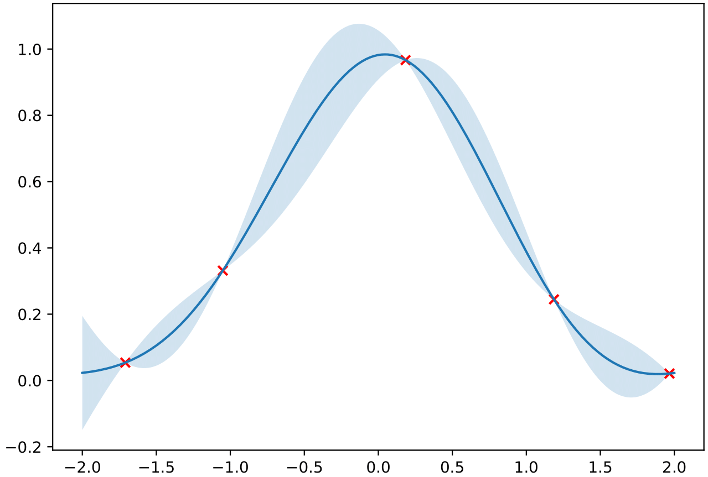
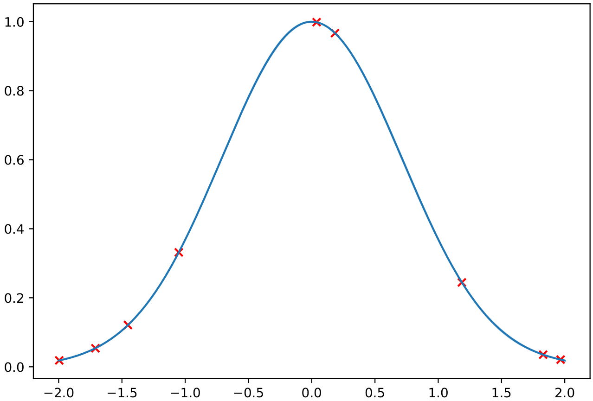

## Overview of the Surrogate Package

The `surrogate` package comprises two main components, [`SurrogateControl`][surrogate.surrogate_control.SurrogateControl] in the [`surrogate_control`][surrogate.surrogate_control] module, and a hierarchy of actual surrogate models in [`surrogate_model`][surrogate.surrogate_model]. In the latter module, [`BaseSurrogateModel`][surrogate.surrogate_model.BaseSurrogateModel] provides a generic interface compatible with the control. The [`SKLearnGPSurrogateModel`][surrogate.surrogate_model.SKLearnGPSurrogateModel] class is the implementation of that interface based on [scikit-learn](https://scikit-learn.org/stable/). Other implementations are possible analogously. The [`SurrogateControl`][surrogate.surrogate_control.SurrogateControl] takes a [`BaseSurrogateModel`][surrogate.surrogate_model.BaseSurrogateModel] derivative along with another callable to generate "true" outputs. We will refer to this as `simulation_model`. As an UM-Bridge server, the surrogate control can receive requests for evaluation for some input parameter set. These calls are dispatched to the prediction of the surrogate or the simulation model, depending on the variance criterion mentioned under [getting started](../index.md). The control further has a daemon process running in the background. Whenever new training data becomes available through simulation model runs, that background process scrapes the data and retrains the surrogate.

The centralized entry point for surrogate runs is the `settings.py` file in each application directory, which we will discuss further in a later section.
All mentioned components have extensive in-code documentation, which we refer the reader to for more detailed information on their usage and implementation.

## Quickstart


To showcase the details of the procedure outlined above, we discuss the workflow for executing [`example_01`](https://github.com/UQatKIT/mtmlda/tree/main/examples/example_01) in the example directory. In this example, the target density we want to emulate is given as a univariate Gaussian distribution, $p = \mathcal{N}(0, \frac{1}{2})$.
To begin with, we set up an UM-Bridge server mimicking a simulation model. We will fetch output data from this model. Run in a first terminal session:
```
python simulation_model.py
```

Next, we pretrain the model, meaning we generate a fixed number of input-output pairs a-priori and train the surrogate with them. Parameter points are chosen with a Latin hypercube sampling algorithm. This functionality is provided by the [`OfflineTrainer`][surrogate.offline_training.OfflineTrainer] class in the [`offline_training`][surrogate.offline_training] module. To execute pretraining, we simply run
```
python run_pretraining.py -app example_01
```

Pretraining will generate a log file and a [`Checkpoint`][surrogate.surrogate_model.SKLearnGPCheckpoint] object, in this case `surrogate_checkpoint_pretraining.pkl`. We visualize the resulting GP prediction mean and 95% confidence intervals, along with the generated data points. At these data points, the GP estimate is sharp, whereas we can observe higher variance further away from the data.

<figure markdown>
{ width="500" style="display: inline-block" }
</figure>

With a pretrained surrogate, whose meta and training data is stored in a checkpoint, we set up an actual surrogate control server via
```
python run_server.py -app example_01
```
The run script reads in the [`SimulationModelSettings`][surrogate.utilities.SimulationModelSettings] and [`SKLearnGPSettings`][surrogate.surrogate_model.SKLearnGPSettings] for the simulation and surrogate model, respectively. In addition, we need to provide a configuration for the control itself via [`ControlSettings`][surrogate.surrogate_control.ControlSettings]. The control is further equipped with a logger, which is configured by a second [`LoggerSettings`][surrogate.utilities.LoggerSettings] instance.

Next, we probe the running surrogate control server with a [`TestClient`][surrogate.test_client.TestClient], configured in [`TestClientSettings`][surrogate.test_client.TestClientSettings]. The client simply calls the server with a number of input parameters,
```
python run_testclient.py -app example_01
```

Whenever the control server needs to call the simulation model and retrain the surrogate during this online phase, it exports a new checkpoint. These checkpoints can be utilized to set up the surrogate and control for subsequent runs, so that no information gets lost.
Looking at the visualization of the last checkpoint, we can see that some additional data points have been fetched by the surrogate. Variance in the estimate is pretty much non-existent by now.
<figure markdown>
{ width="500" style="display: inline-block" }
</figure>


After the pretraining and test client runs, we can assess all surrogate checkpoints through visualization:
```
python run_visualization.py -app example_01
```

Basically, the visualization code trains a surrogate for every of the exported checkpoints it can find in the results directory. Subsequently, it visualizes the mean output and associated 95% confidence intervals of the respective surrogates, depending on the dimension of the parameter space.

## Configuration

The settings file is the unified entry point for the configuration of the simulation model, the surrogate and the control. It implements data classes that serve as input settings for the respective components. In the following, we give a detailed overview of these settings.

<style> table th:first-of-type { width: 300px; } table th:nth-of-type(2) { width: 700px; } </style> 

| `SimulationModelSettings` | Set up UMBridge Model server                     |
| ------------------------- | ------------------------------------------------ |
| `url`                     | Address of the simulation model UM-Bridge server |
| `name`                    | Name of the simulation model UM-Bridge server    |

| `SKLearnGPSettings`               | Provides the configuration of the surrogate model to pretrain (see scikit-learn docs for more details)                                      |
| --------------------------------- | ------------------------------------------------------------------------------------------------------------------------------------------- |
| `scaling_kernel`                  | Is the prefactor for the GP kernel function                                                                                                 |
| `correlation_kernel`              | Is the correlation function for the GP kernel function                                                                                      |
| `data_noise`                      | Assumed noise on output data, should be larger than zero for numerical stability                                                            |
| `num_optimizer_restarts`          | Maximum number of restarts for optimization (with *l-bfgs-b*)                                                                               |
| `minimum_num_training_points`     | Number of training points below which surrogate is not retrained yet                                                                        |
| `normalize_output`                | Whether to normalize the regressor prediction within scikit-learn                                                                           |
| `perform_log_transform`           | Whether the output of the surrogate should be log-transformed                                                                               |
| `variance_is_relative`            | Whether the variance in the surrogate prediction should be normalized, either by a provided reference or by the range of the training data. |
| `variance_reference`              | Reference for normalization of the variance, if wanted                                                                                      |
| `value_range_underflow_threshold` | Minimal value for value range, employed for numerical stability in normalization                                                            |
| `log_mean_underflow_value`        | Value below which the log-transformed output is cut off, for numerical stability                                                            |
| `mean_underflow_value`            | Value below which the not log-transformed output is cut off, for numerical stability                                                        |
| `init_seed`                       | Seed for initialization of the optimizer                                                                                                    |
| `checkpoint_load_file`            | Checkpoint file to initialize surrogate from (not used for pretraining)                                                                     |
| `checkpoint_save_path`            | File stub to save newly generated checkpoints to                                                                                            |

| `OfflineTrainingSettings`     | Configure offline training                                                                                         |
| ----------------------------- | ------------------------------------------------------------------------------------------------------------------ |
| `num_offline_training_points` | Number of parameter samples for pretraining                                                                        |
| `num_threads`                 | Number of threads for asynchronous model evaluation                                                                |
| `offline_model_config`        | Configuration argument for UM-Bridge calls to the simulation model server                                          |
| `lhs_bounds`                  | Dimension-wise bounds for latin hypercube sampling                                                                 |
| `lhs_seed`                    | Seed for initialization of the latin hypercube sampling algorithm                                                  |
| `checkpoint_save_name`        | id for the checkpoint to save, will be appended to the `checkpoint_save_path` in the surrogate model configuration |

| `LoggerSettings` | Configure logger                               |
| ---------------- | ---------------------------------------------- |
| `do_printing`    | Determines whether to log info to the terminal |
| `logfile_path`   | File to log info to, if provided               |
| `write_mode`     | Write mode for the log file                    |


| `ControlSettings`             | Configure the surrogate control                                                                                                                         |
| ----------------------------- | ------------------------------------------------------------------------------------------------------------------------------------------------------- |
| `port`                        | URL under which the control will be served as an UM-Bridge server                                                                                       |
| `name`                        | Name under which the control will be served as an UM-Bridge server                                                                                      |
| `minimum_num_training_points` | Number of available training samples below which the surrogate is not used for prediction yet                                                           |
| `update_interval_rule`        | Callable determining after how many training samples the surrogate is re-trained next, given the number of samples after the last fitting procedure     |
| `variance_threshold`          | Value of the variance in the surrogate prediction (absolute or relative), below which the surrogate is used as predictor (and not the simulation model) |
| `overwrite_checkpoint`        | Whether to overwrite checkpoints during the server run. If not, checkpoints are equipped with an integer id                                             |


| `TestClientSettings` | Configure a test client                                            |
| -------------------- | ------------------------------------------------------------------ |
| `control_url`        | Address of the control UM-Bridge server                            |
| `control_name`       | Name of the control UM-Bridge server                               |
| `simulation_config`  | Configuration argument for UM_Bridge calls to the simulation model |
| `training_params`    | Input parameter samples to probe the control server with           |


| `VisualizationSettings` | Configure visualization |
|-------|-----|
| `offline_checkpoint_file` | Path to pickled offline training checkpoint |
|`online_checkpoint_filestub` | Path to pickled online checkpoints, ids will be appended automatically |
| `visualization_file` | Where to save resulting figures |
| `visualization_bounds` | Bounds of the hyper rectangle over which to visualize surrogate output, has to match parameter space dimension |